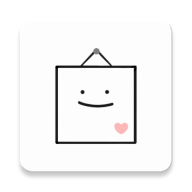

# 캘린이

  

  
  
  
  

## Screenshots & Videos
<table>
  <tbody align=center>
    <tr>
      <td></td>
      <td></td>
      <td></td>
    </tr>
    <tr>
      <td rowspan=2>회원가입</td>
      <td>캘린이 로그인</td>
      <td>구글 로그인</td>
    </tr>
    <tr>
      <td colspan=2>로그인 및 커플 연결</td>
    </tr>
    <tr>
      <td></td>
      <td></td>
      <td></td>
    </tr>
    <tr>
      <td>user1 화면</td>
      <td>user2 화면</td>
      <td rowspan=2>파일 타입 채팅</td>
    </tr>
    <tr>
      <td colspan=2>텍스트 메세지 전송 및 채팅 알림</td>
    </tr>
    <tr>
      <td></td>
      <td></td>
      <td></td>
    </tr>
    <tr>
      <td>이미지 전송</td>
      <td>이미지 상세 화면 및 메뉴 (저장, 공유, 기타정보)</td>
      <td>이미지 정보</td>
    </tr>
    <tr>
      <td></td>
      <td></td>
      <td></td>
    </tr>
    <tr>
      <td>동영상 전송</td>
      <td>동영상 상세 화면 및 메뉴 (저장, 공유, 기타정보)</td>
      <td>동영상 정보</td>
    </tr>
    <tr>
      <td></td>
      <td></td>
      <td></td>
    </tr>
    <tr>
      <td colspan=2>오늘의 한마디 설정</td>
      <td>오늘의 한마디 설정된 메인 화면</td>
    </tr>
  </tbody>
</table>

## Drawings
<table>
  <tbody align=center>
    <tr>
      <td></td>
      <td></td>
      <td></td>
      <td></td>
      <td></td>
      <td></td>
    </tr>
    <tr>
      <td>이미지 파일</td>
      <td>동영상 파일</td>
      <td>오디오 파일</td>
      <td>doc 파일</td>
      <td>pdf 파일</td>
      <td>기타 파일</td>
    </tr>
    <tr>
      <td colspan=6>파일 아이콘</td>
    </tr>
  </tbody>
</table>
